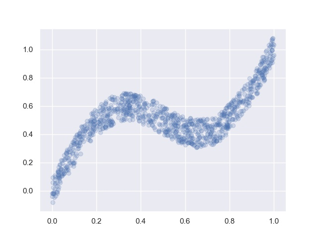
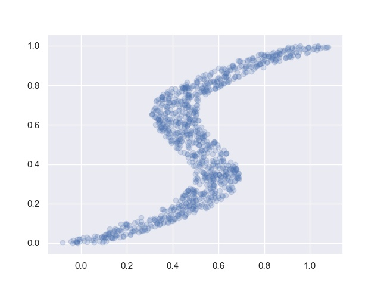
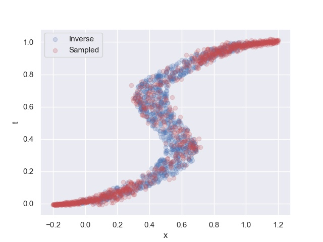

# Mixture Density Network

---

Implementation of Mixture Density Network in PyTorch

An MDN models the conditional distribution over a *scalar* response as a mixture of Gaussians.
<div align="center">
</img>
</div>
where the mixture distribution parameters are output by a neural network, trained to maximize overall log-likelihood. The set of mixture distribution parameters is the following.

<div align="center">
</img>
</div>

In order to predict the response as a *multivariate* Gaussian distribution (for example, in [2]), we assume a fully factored distribution (i.e. a diagonal covariance matrix) and predict each dimension separately. We assume each component of the distribution is statistically independent.


### Usage
```python
import torch 
import torch.nn as nn
import torch.optim as optim
from models.mdn import MixtureDensityNetworks
from utils.loss import MDN_loss
from utils.utils import sample

model=nn.Sequential(
	nn.Linear(1,20),
	nn.Tanh(),
	MixtureDensityNetworks(20,1,5),
)

opt=optm.Adam(model.parameters())

for e in range(num_epochs):
	opt.zero_grad()
	pi,mu,sigma=model.forward(x_var)
	loss=MDN_loss(t_var,pi,mu,sigma)
	loss.backward()
	opt.step()

pi,mu,sigma=model.forward(mini)
samples=samples(pi,mu,sigma)
```
<div align='center'>
</img>
<h4> Original data</h4>
</img>
<h4 > Inverse data</h4>
</img>
<h4> Inverse and sampled data</h4>
</div>


#### References

Bishop, C. M. Mixture density networks. (1994).
